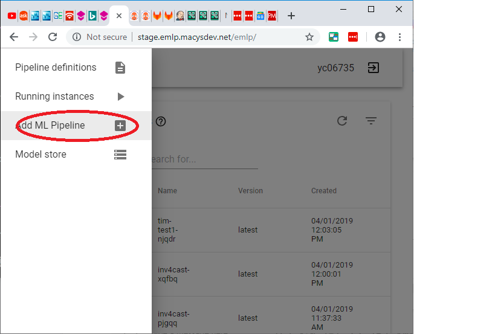

# Spark ALS


## clone this repo on your computer

```console
cd
git clone https://github.com/elephantscale/emlp-labs-macys.git 
```

## Set your name in your bash shell

Open up a bash shell.

```bash
export YOURNAME=<enter your name here>
```

This environment variable will make life easier. Remember this name that you used


## Go to EMLP Staging in your browser

Go to [EMLP Staging](http://stage.emlp.macysdev.net/emlp)

```text
http://stage.emlp.macysdev.net/emlp
```


## Click on Add New



## Create the name


## Create the workflow


## Go to tasks


## Create 2 tasks

Create 2 tasks:

1. knn-recommender
2. als-recommender

Use "Python3" for both of them as the starter template.

Just accept the defaults for the task resource definition and click next

Just accept the defaults for the command and again click next.

We don't need any environment variables so again click next.

We don't need a volume so at the very end click "Create"

Repeat the same for als-recommender.


## Create 2 Steps

Go to steps:


Create 2 Steps:

1. `running-als`
2. `running-knn`

Just accept defaults for both


Here is what is should look like when you create the stps:


## Go to Gitlab

It should be at the following address [Gitlab](https://code.devops.fds.com/emlp-stage)

```text
https://code.devops.fds.com/emlp-stage
```


## Find your repo by name 

You can use the filter option.


## Copy the repo name

Copy that to your clipboard


## Clone the repo

```bash
cd
git clone git@code.devops.fds.com:emlp-stage/$YOURNAME-als-spark-ml.git
```


## Copy the files to the repository

```console
cp ~/emlp-labs-macys/spark-als/code/* ~/$YOURNAME-als-spark-ml/

```

## Change the ml-workflow.yaml file

Go to 

```console
cd ~/$YOURNAME-als-spark-ml
```

Go to line 15 of the `config/ml-workflow.yaml` file and change the YOURNAME
portion to your name


## Add the files to your gitlab repository

```console
cd ~/$YOURNAME-als-spark-ml
git add config/*.yaml
git add als-recommender
git add knn-recommender
git add functional_tests
```

## Check git status and make sure it looks right

```console
git status
```


## Check your email and make sure it says your Macy's email and not something else

```
git config --user.email
```

## Now do a commit and push

```
git commit
# Enter your commit message
git push
```

## Check jenkins to make sure it is there.


```text
https://platform-ci.devops.fds.com/jenkins/view/EMLP/view/Jobs/job/emlp-build/
```

Wait until the job is finished building


## Run the Workflow


## List Running


## Start Apache Argo


## Look at Logs


