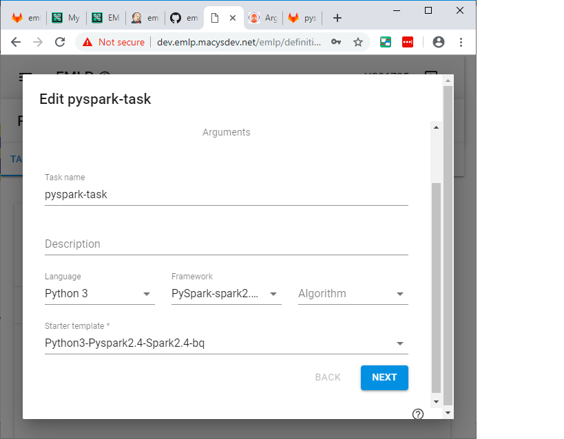
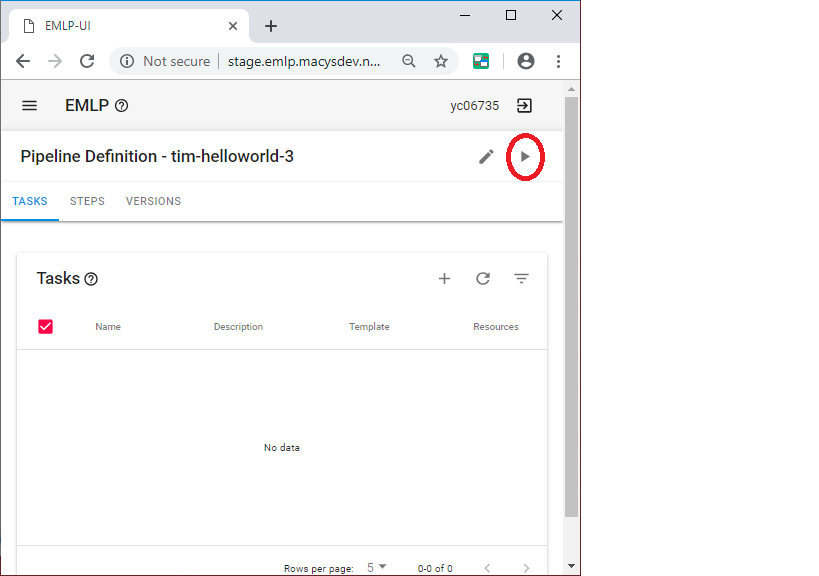

# BigQuery 

Here we are going to do a BigQuery example


## clone this repo on your computer

```console
cd
git clone https://github.com/elephantscale/emlp-labs-macys.git 
```

## Set your name in your bash shell

Open up a bash shell.

```bash
export YOURNAME=<enter your name here>
```

This environment variable will make life easier. Remember this name that you used


## Go to EMLP Staging in your browser

Go to [EMLP stage](http://stage.emlp.macysdev.net/emlp)

```text
http://stage.emlp.macysdev.net/emlp
```

## Click on Add New


## Create the name

Call it `YOURNAME-bq`


## Go to tasks

Go to create a task.

Create task by the name of "t1"

Use the starter template `Python3-Pyspark2.4-Spark2.4-bq`



## Add a volume

You will need a volume for the secrets.  On the last step you will need to create a *volume*.

Use the dropdown for the secrets


Go ahead and save.


## Create a step for your task

Create a step for your task.


## Go to Gitlab

It should be at the following address [Gitlab](https://code.devops.fds.com/)

```text
https://code.devops.fds.com/
```


## Clone the repo

Go ahead and clone your repo.

Make changes to the main.py file by copying [this file](./src/main.py)

## Add to requirements.txt

Add the following to the end of the `requirements.txt` file:

```text
google-cloud-bigquery
```

## Commit the results

```bash
git add t1/requirements.txt
git add t1/src/main.py
git commit
git push
```


## Run the Workflow



## List Running


## Start Apache Argo


## Look at Logs


You should see something like this:


