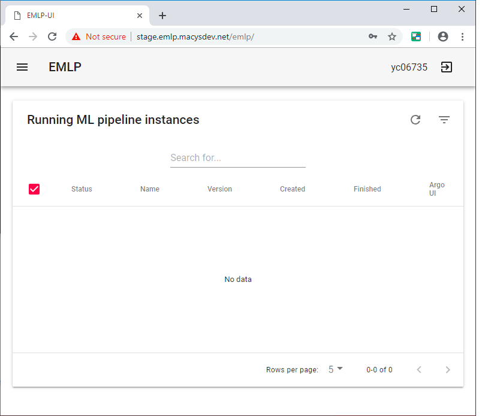
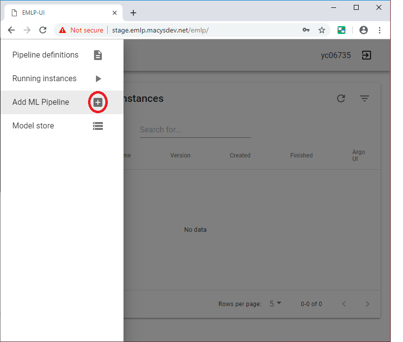
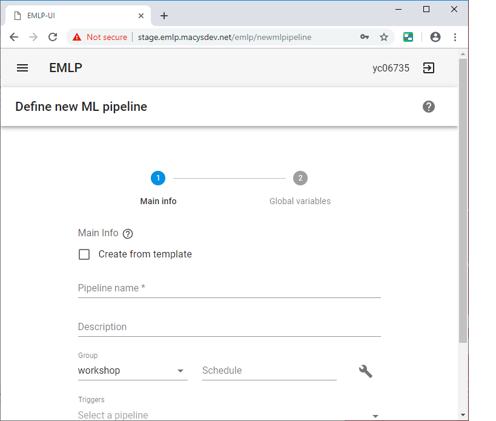
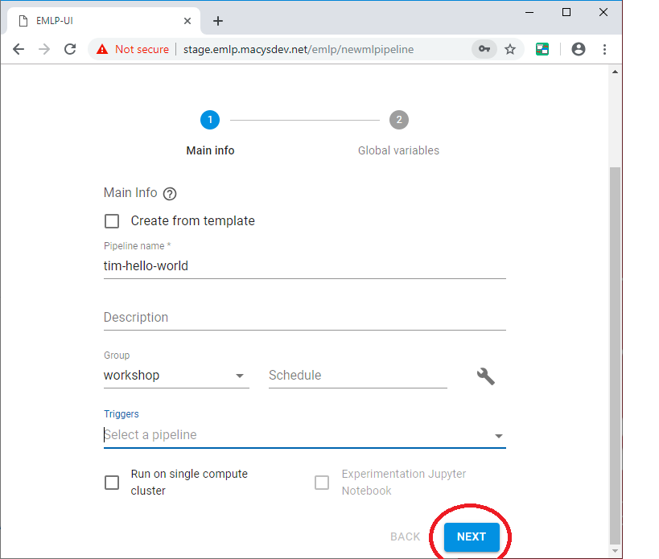
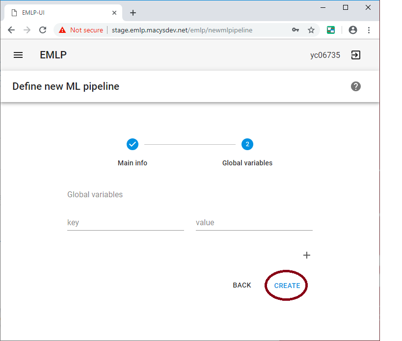
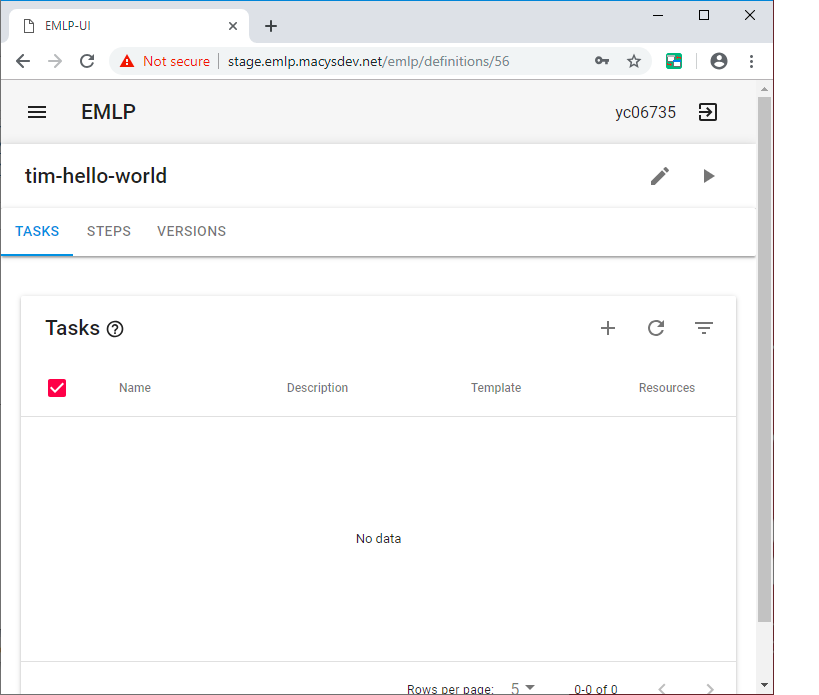

# Hello world EMLP

## Step 1: Login to EMLP

Use your Macy's credentials

## Step 2: Enter EMLP

## Step 3: Add new Pipeline

## Step 4: Define new pipeline

## Step 5: Define the hello world pipeline

## Step 6: Specify Global Variables

## Step 7: Finish Workflow

## Step 8: Run the Workflow

## Step 9: List Running

## Step 10: Start Apache Argo

## Step 11: Look at Logs

Folowing this it should say "Hello World!"

Congrations! You have just run your first workflow!
