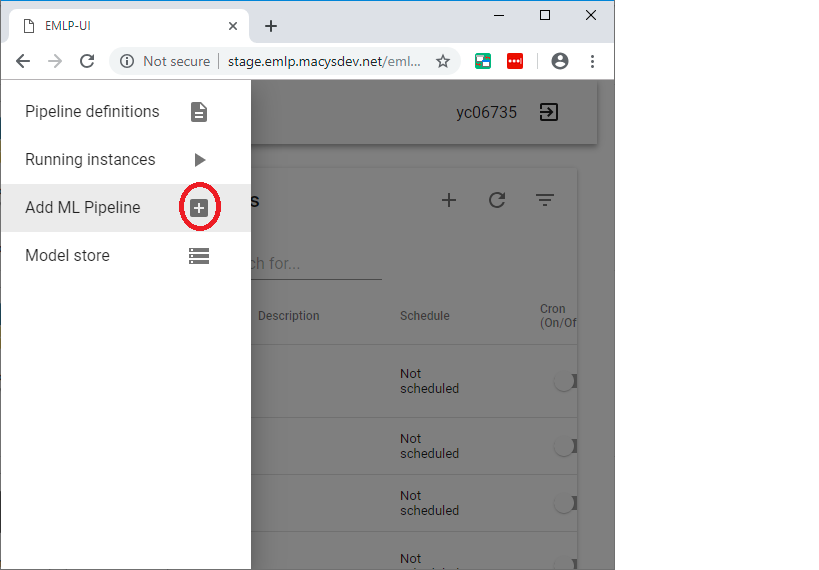
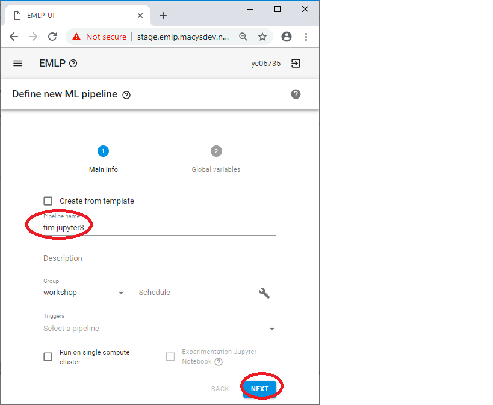
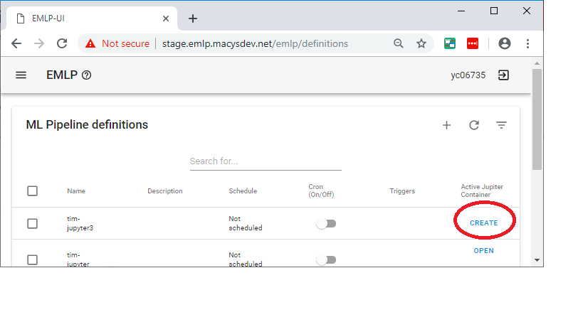
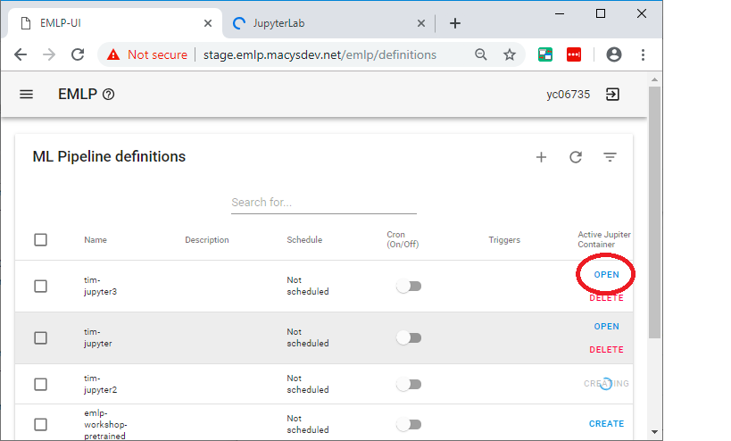
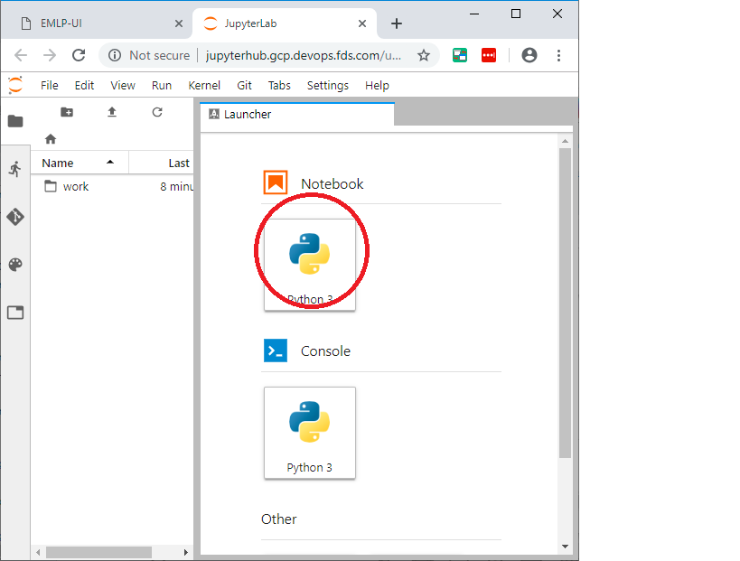
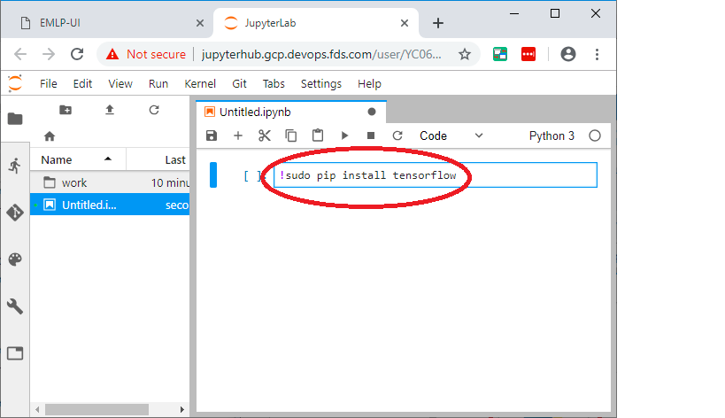
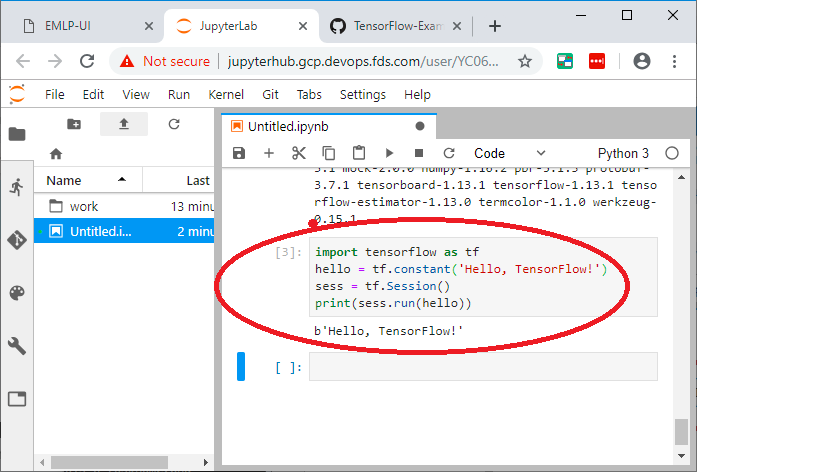

# Jupyter Notebok on EMLP

This is setting up juptyer notebook on EMLP

## Step 1: Create a New Pipeline


## Step 2: Give the Pipeline a Name


## Step 3: Give the Pipeline a Definition


## Step 3: Launch the Jupyter notebook


## Step 4: Open a Notebook


## Step 5: install tensorflow with pip

Install tensorflow like this:

```pycon
!sudo pip install tensorflow
```




## Step 6: Do a hello world code with tensorflow

```python
import tensorflow as tf
hello = tf.constant('Hello, TensorFlow!')
sess = tf.Session()
print(sess.run(hello))
```




