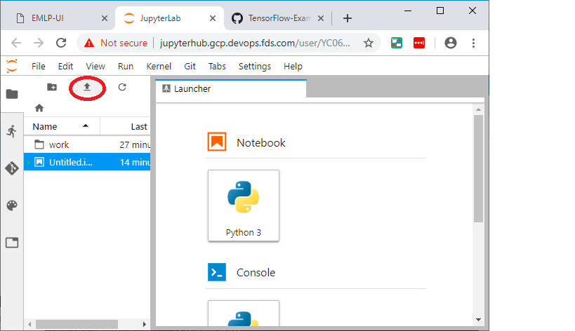
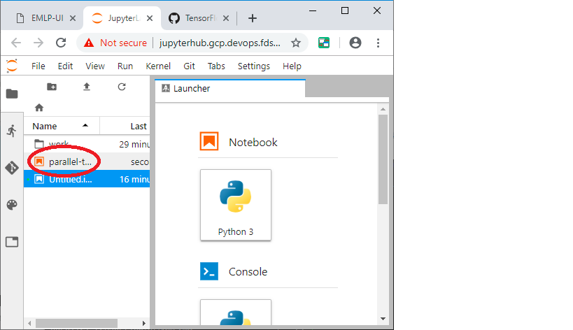
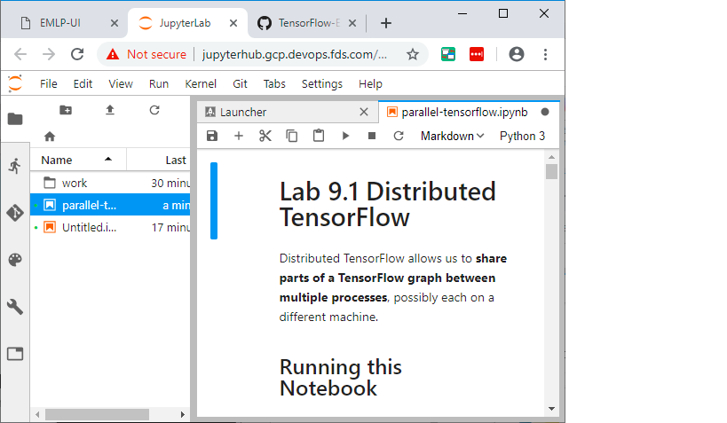

# Parallel Tensorflow on EMLP

## Step 1: Get to a running jupyter notebook

If you have already done the earlier lab here

[Jupyter Notebook Setup](../jupyter/jupyter-notebook.md)

## Step 2: Upload the file 

You should have the distributed tensorflow lab [here](./parallel-tensorflow.ipynb)

[Download Link](./parallel-tensorflow.ipynb)

You can upload this file to Jupyter

## Step 3: Locate the Notebook

## Step 4: Run the Notebook

Go ahead and run the notebook. This will be running in local mode.

