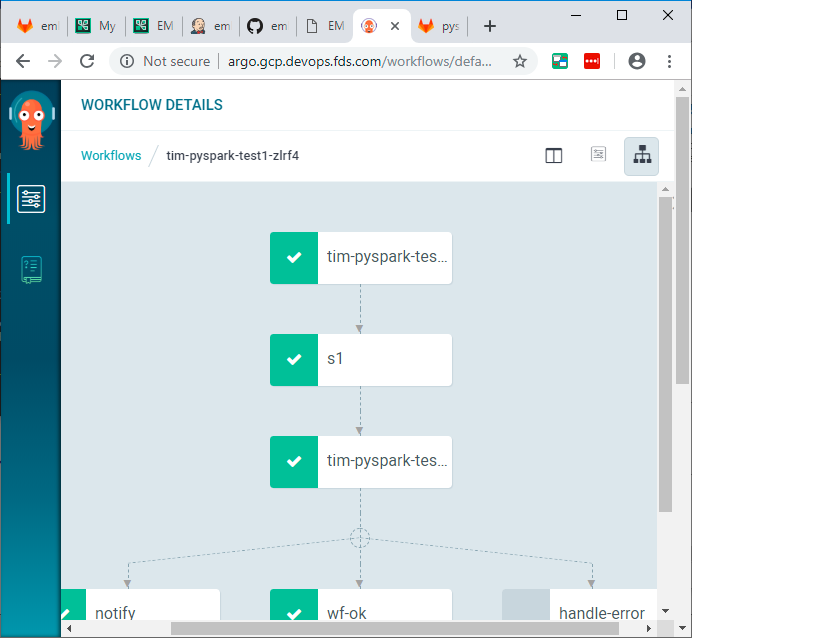

# Spark ALS

Here we are going to do a spark ALS example


## clone this repo on your computer

```console
cd
git clone https://github.com/elephantscale/emlp-labs-macys.git 
```

## Set your name in your bash shell

Open up a bash shell.

```bash
export YOURNAME=<enter your name here>
```

This environment variable will make life easier. Remember this name that you used


## Go to EMLP Staging in your browser

Go to [EMLP dev](http://dev.emlp.macysdev.net/emlp)

```text
http://dev.emlp.macysdev.net/emlp
```

## Click on Add New


## Create the name

Call it `YOURNAME-spark-als`

Go ahead and save.


## Go to tasks

Go to create a task.

Create task by the name of "pyspark-task"

Use the starter template `Python3-Pyspark2.4-Spark2.4-bq`


## Create a step for your task

Create a step for your task.


## Go to Gitlab

It should be at the following address [Gitlab](https://code.devops.fds.com/)

```text
https://code.devops.fds.com/
```


## Clone the repo

Go ahead and clone your repo.

## Copy the file and c ommit and push

copy the file `src/main.py` to the repo.
copy the data files `src/*.csv` to the repo

Make changes to the main.py file by copying [this file](./src/main.py)

Also go ahead and add the data which is [src/ratings.csv](./src/ratings.csv) and [src/movies.csv](./src/movies.csv)


```bash

git add src/*.csv
git add src/main.py
git commit -m "Added source and data file"
git push
```

## Edit the requirements.txt file in the repo

You will need to add the following:

```text
numpy
pandas
```


## Run the Workflow


## List Running


## Start Apache Argo


## Look at Logs


You should see something like this;

```text
l: 3
o: 2
r: 1
H: 1
e: 1
W: 1
d: 1
: 1
```


