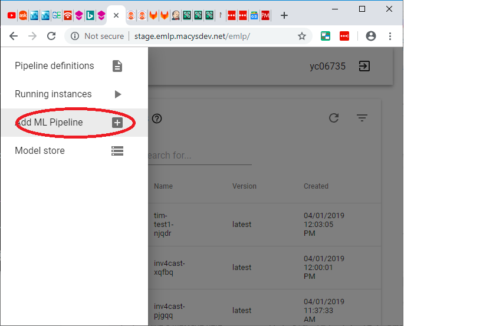
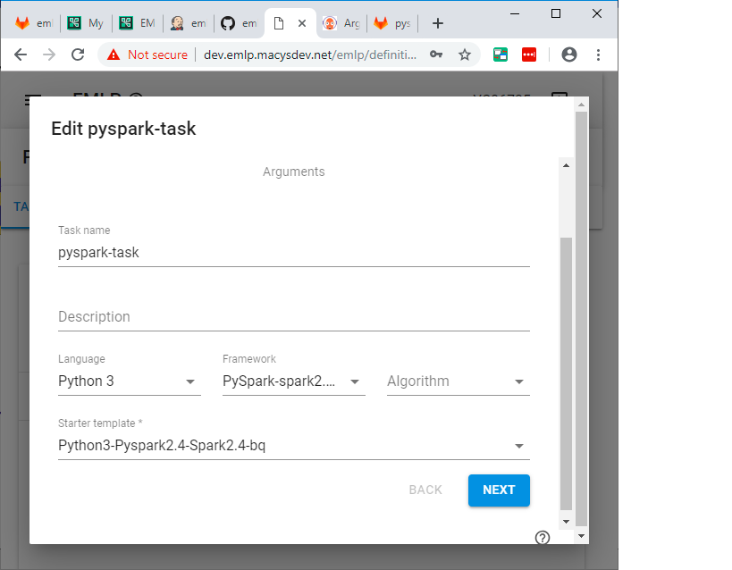
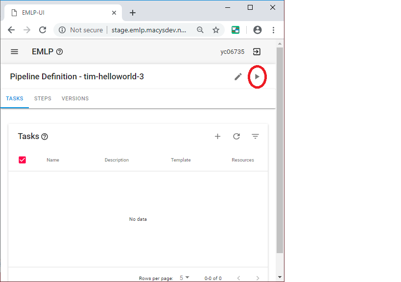
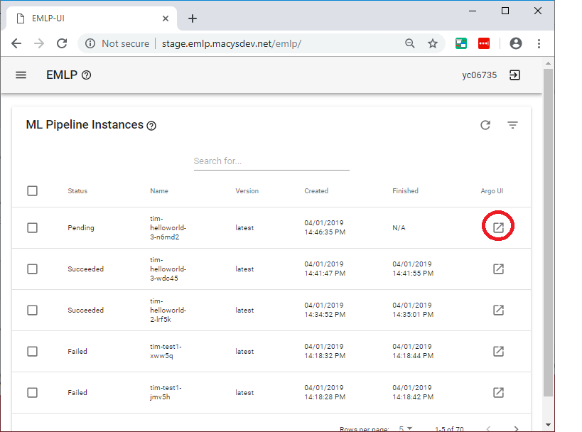
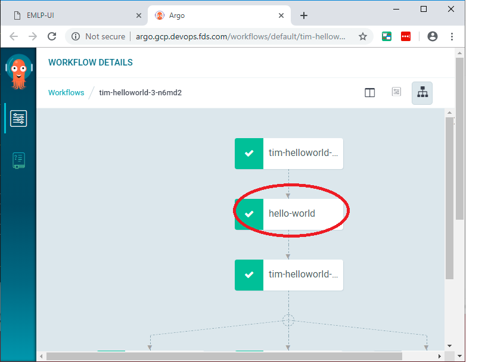
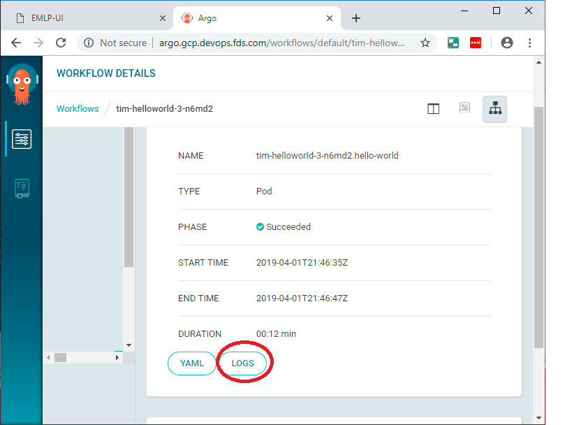

# Spark Wordcount

Here we are going to do a spark wordcount example


## clone this repo on your computer

```console
cd
git clone https://github.com/elephantscale/emlp-labs-macys.git 
```

## Set your name in your bash shell

Open up a bash shell.

```bash
export YOURNAME=<enter your name here>
```

This environment variable will make life easier. Remember this name that you used


## Go to EMLP Staging in your browser

Go to [EMLP dev](http://dev.emlp.macysdev.net/emlp)

```text
http://dev.emlp.macysdev.net/emlp
```

## Click on Add New



## Create the name

Call it `YOURNAME-spark-wc`

Go ahead and save.


## Go to tasks

Go to create a task.

Create task by the name of "pyspark-task"

Use the starter template `Python3-Pyspark2.4-Spark2.4-bq`




## Create a step for your task

Create a step for your task.


## Go to Gitlab

It should be at the following address [Gitlab](https://code.devops.fds.com/)

```text
https://code.devops.fds.com/
```


## Look at the code

It should be in the `pyspark-task/src/main.py` location:

```python
import findspark
findspark.init("/opt/spark")

from pyspark import SparkContext
from operator import add

sc = SparkContext()
data = sc.parallelize(list("Hello World"))
counts = data.map(lambda x: (x, 1)).reduceByKey(add).sortBy(lambda x: x[1], ascending=False).collect()
for (word, count) in counts:
    print("{}: {}".format(word, count))
sc.stop()

```


## Run the Workflow



## List Running


## Start Apache Argo


## Look at Logs



You should see something like this;

```text
l: 3
o: 2
r: 1
H: 1
e: 1
W: 1
d: 1
: 1
```


