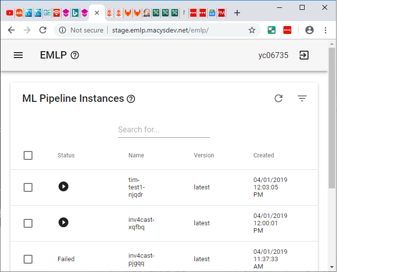
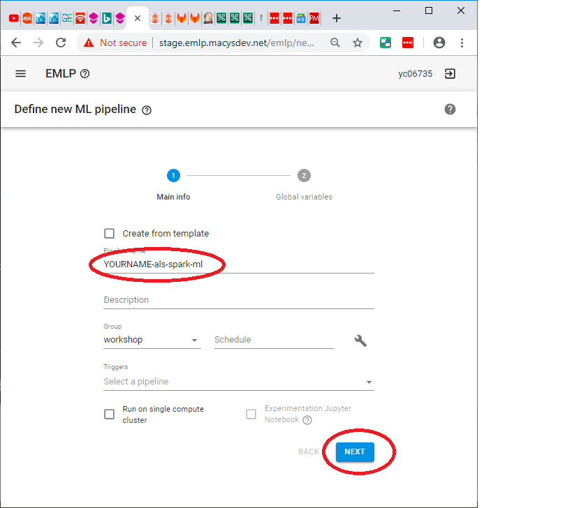
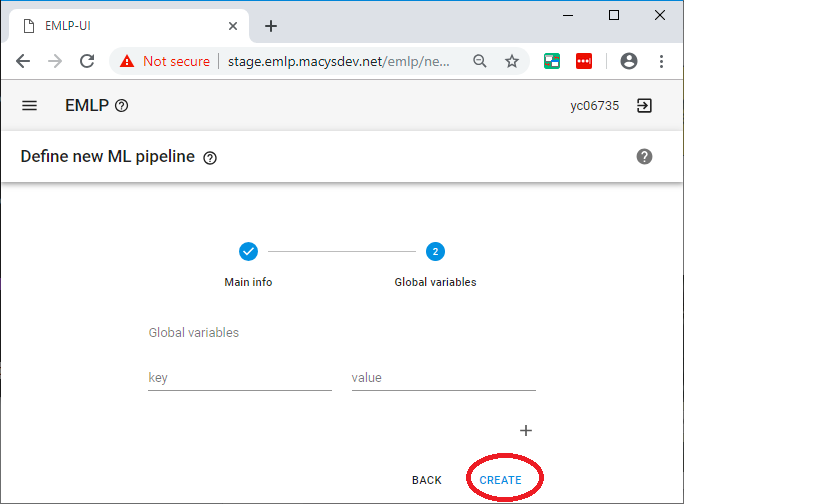
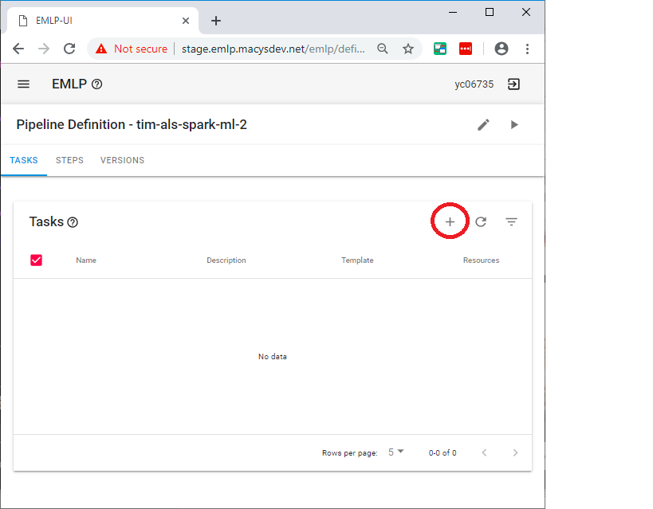
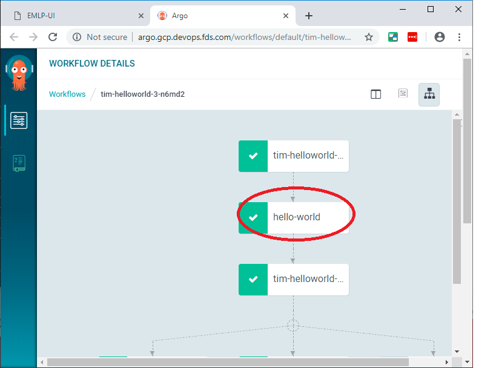
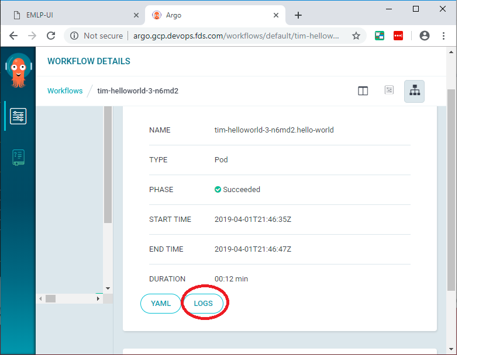

# Spark ALS


## clone this repo on your computer

```console
cd
git clone https://github.com/elephantscale/emlp-labs-macys.git 
```

## Set your name in your bash shell

Open up a bash shell.

```bash
export YOURNAME=<enter your name here>
```

This environment variable will make life easier. Remember this name that you used


## Go to EMLP Staging in your browser

Go to [EMLP Staging](http://stage.emlp.macysdev.net/emlp)

```text
http://stage.emlp.macysdev.net/emlp
```




## Click on Add New and create name




## Create the workflow



## Go to tasks




## Create a task


*  tensorflow-task

Use "Python3" 


Here we will be using a custom set of resources


Create a task 

Just accept the defaults for the command and again click next.

We don't need any environment variables so again click next.

We don't need a volume so at the very end click "Create"

Repeat the same for als-recommender.


## Create 2 Steps

Go to steps:


Create 2 Steps:

1. `running-als`
2. `running-knn`

Just accept defaults for both


Here is what is should look like when you create the stps:


## Go to Gitlab

It should be at the following address [Gitlab](https://code.devops.fds.com/emlp-stage)

```text
https://code.devops.fds.com/emlp-stage
```


## Find your repo by name 

You can use the filter option.


## Copy the repo name

Copy that to your clipboard


## Clone the repo

```bash
cd
git clone git@code.devops.fds.com:emlp-stage/$YOURNAME-tensorflow-mnist.git
```


## Copy the files to the repository

```console
cp ~/emlp-labs-macys/tensorflow-mnist/tensorflow-task/requirements.txt ~/$YOURNAME-tensorflow-mnist/tensorflow-task/
cp ~/emlp-labs-macys/tensorflow-mnist/tensorflow-task/src/main.py ~/$YOURNAME-tensorflow-mnist/tensorflow-task/src/

```
## Add the files to your gitlab repository

```console
cd ~/$YOURNAME-tensorflow-mnist
git add tensorflow-task/requirements.txt
git add tensorflow-task/src/main.py
```

## Check git status and make sure it looks right

```console
git status
```


## Check your email and make sure it says your Macy's email and not something else

```
git config --user.email
```

## Now do a commit and push

```
git commit
# Enter your commit message
git push
```

## Check jenkins to make sure it is there.


```text
https://platform-ci.devops.fds.com/jenkins/view/EMLP/view/Jobs/job/emlp-build/
```

Wait until the job is finished building


## Run the Workflow


## List Running


## Start Apache Argo


## Look at Logs




